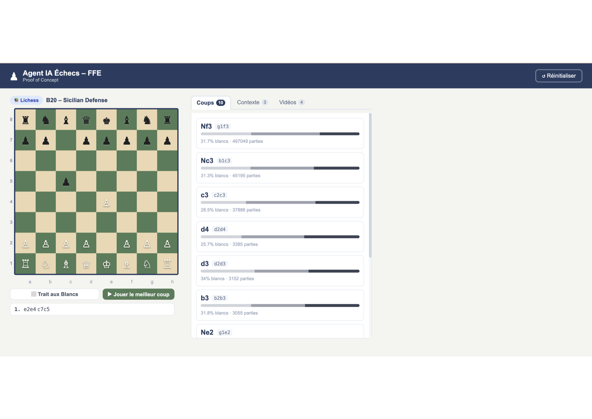

# FFE Chess Agent

Agent IA pour l'apprentissage des ouvertures aux échecs.

**Auteur :** Bintou DIOP , Proof of Concept

> **Stack :** FastAPI | LangGraph | Milvus | MongoDB | Angular 18 | Stockfish | Mistral AI

---

## Présentation

**FFE Chess Agent** est une application web intelligente destinée aux joueurs d'échecs souhaitant progresser dans la connaissance des ouvertures. L'utilisateur déplace les pièces sur un échiquier interactif et reçoit instantanément :

- les **coups théoriques** les plus joués par les Maîtres (source : Lichess)
- une **analyse moteur** Stockfish pour les positions hors théorie
- des **extraits de cours** issus d'une base de connaissances vectorielle (RAG)
- une **explication pédagogique en français** générée par un LLM (Mistral AI)
- des **vidéos YouTube** sélectionnées sur l'ouverture en cours

---

## Aperçu de l'interface



L'interface présente un échiquier interactif (gauche) et un panneau d'analyse (droite) avec trois onglets : 

**Coups** (coups théoriques Lichess avec statistiques Masters), 
**Contexte** (explication pédagogique Mistral AI + extraits RAG) et **Vidéos** (YouTube).

---

## Architecture

```
                        +------------------+
                        |  Angular 18 UI   |  (port 4200)
                        +--------+---------+
                                 |
                                 | HTTP /api/v1/agent
                                 v
                        +--------+---------+
                        |  FastAPI Backend  |  (port 8000)
                        +--------+---------+
                                 |
              +------------------+------------------+
              |                  |                  |
     +--------+--------+ +-------+-------+ +--------+--------+
     |    LangGraph    | |    Milvus     | |    MongoDB      |
     |    Workflow     | | RAG vectoriel | | cache + histor. |
     | (chess_graph)   | |  port 19530   | |   port 27017    |
     +--------+--------+ +---------------+ +-----------------+
              |
     +--------+----------+------------------+
     |        |           |                  |
+----+----+ +-+-------+ +-+----------+ +----+----------+
| Lichess | |Stockfish| | Mistral AI | | YouTube API   |
| Explorer| | Engine  | |   (LLM)    | | (vidéos)      |
+---------+ +---------+ +------------+ +---------------+
```

### Workflow de l'agent (LangGraph)

```
[Position FEN]
      |
      v
 validate_fen ---(invalide)---> build_response
      |
      v
 fetch_lichess
      |
      +---(coups trouvés)---> enrich_context (RAG + YouTube)
      |                                |
      +---(hors théorie)---> stockfish_fallback
                                       |
                                       v
                            generate_explanation (Mistral)
                                       |
                                       v
                                 build_response
                                       |
                                       v
                                [Réponse JSON]
```

---

## Technologies utilisées

| Composant | Technologie | Rôle |
|-----------|-------------|------|
| Frontend | Angular 18 | Interface échiquier |
| Backend | FastAPI + Uvicorn | API REST asynchrone |
| Orchestration IA | LangGraph | Workflow agent |
| LLM | Mistral AI (Large) | Explications en français |
| Moteur d'échecs | Stockfish 16 | Analyse des positions |
| Base vectorielle | Milvus 2.4 | Recherche sémantique (RAG) |
| Base de données | MongoDB 7 | Cache réponses + historique |
| Données ouvertures | Lichess Explorer API | Statistiques Masters |
| Vidéos | YouTube Data API v3 | Ressources pédagogiques |
| Stockage objet | MinIO | Persistence Milvus |
| Déploiement | Docker Compose | Orchestration 7 services |

---

## Prérequis

- [Docker Desktop](https://www.docker.com/products/docker-desktop/) >= 24
- Clé API **YouTube Data v3** -> [Google Cloud Console](https://console.cloud.google.com)
- Clé API **Mistral AI** -> [console.mistral.ai](https://console.mistral.ai)

---

## Installation et démarrage

### 1. Cloner le projet

```bash
git clone <url-du-repo>
cd ffe_chess_agent
```

### 2. Configurer les variables d'environnement

Créer un fichier `.env` à la racine du projet :

```env
YOUTUBE_API_KEY=votre_cle_youtube
MISTRAL_API_KEY=votre_cle_mistral
MINIO_ROOT_USER=minio
MINIO_ROOT_PASSWORD=motdepasse_minio
MINIO_ADDRESS=minio:9000
```

### 3. Démarrer le stack Docker

```bash
docker compose up --build
```

> Le premier démarrage télécharge les images Docker (~2-3 min).

### 4. Peupler la base de connaissances (une seule fois)

```bash
docker compose exec backend python scripts/ingest_wikichess.py --limit 3500
```

Cette commande télécharge le dataset ECO complet depuis la base officielle Lichess (~4 000 ouvertures) et les indexe dans Milvus pour la recherche sémantique.

### 5. Accéder à l'application

| Interface | URL |
|-----------|-----|
| Application web | http://localhost:4200 |
| Documentation API (Swagger) | http://localhost:8000/docs |

---

## Utilisation

1. **Déplacer les pièces** sur l'échiquier : cliquer la pièce puis la case de destination
2. **Onglet Coups** : voir les coups théoriques avec leurs statistiques (% victoire blancs/noirs/nul)
3. **Onglet Contexte** : lire l'explication pédagogique générée par Mistral + les extraits de cours RAG
4. **Onglet Vidéos** : visionner des vidéos YouTube sur l'ouverture jouée
5. **Bouton Réinitialiser** : repartir de la position initiale

---

## Endpoints API

| Méthode | Route | Description |
|---------|-------|-------------|
| `POST` | `/api/v1/agent` | Workflow complet (analyse une position FEN) |
| `GET` | `/api/v1/moves/{fen}` | Coups théoriques Lichess Masters |
| `GET` | `/api/v1/evaluate/{fen}` | Analyse Stockfish |
| `POST` | `/api/v1/vector-search` | Recherche sémantique dans Milvus |
| `GET` | `/api/v1/videos/{opening}` | Vidéos YouTube pour une ouverture |
| `GET` | `/api/v1/healthcheck` | Statut du service |

---

## Structure du projet

```
ffe_chess_agent/
|
+-- backend/
|   +-- app/
|   |   +-- agent/
|   |   |   +-- chess_graph.py        # Workflow LangGraph (6 noeuds)
|   |   +-- api/v1/routes/
|   |   |   +-- agent.py              # Route principale (avec cache MongoDB)
|   |   |   +-- moves.py              # Coups Lichess
|   |   |   +-- evaluate.py           # Analyse Stockfish
|   |   |   +-- search.py             # Recherche vectorielle
|   |   |   +-- videos.py             # Vidéos YouTube
|   |   +-- services/
|   |   |   +-- lichess_service.py    # Lichess Explorer API
|   |   |   +-- stockfish_service.py  # Moteur Stockfish (singleton async)
|   |   |   +-- milvus_service.py     # Base vectorielle + embeddings
|   |   |   +-- youtube_service.py    # YouTube Data API v3
|   |   |   +-- llm_service.py        # Mistral AI
|   |   |   +-- mongo_service.py      # Cache TTL 1h + historique
|   |   +-- core/config.py            # Configuration (variables d'env)
|   +-- scripts/
|   |   +-- ingest_wikichess.py       # Ingestion des ouvertures dans Milvus
|   +-- requirements.txt
|   +-- Dockerfile
|
+-- frontend/
|   +-- src/app/
|       +-- app.component.ts          # Echiquier + logique de jeu
|       +-- app.component.html        # Template (echiquier + onglets)
|       +-- app.component.scss        # Styles
|       +-- services/
|       |   +-- chess-api.service.ts  # Client HTTP typé vers le backend
|       +-- pipes/
|           +-- trust-url.pipe.ts     # Sanitisation des URLs YouTube
|
+-- docker-compose.yml                # Orchestration 7 services
+-- schemas_architecture_FFE.pdf      # Schémas d'architecture détaillés
+-- DEMO_SCENARIOS.md                 # Scénarios de test de l'agent
+-- .env                              # Variables secrètes (non versionné)
```

---

## Fonctionnement du cache

Les réponses de l'agent sont automatiquement mises en cache dans MongoDB (TTL : 1 heure). Pour une même position FEN, la deuxième requête est instantanée sans solliciter Lichess, Stockfish ou Mistral AI.

---

## Licence

Copyright © 2026 Bintou DIOP. Tous droits réservés.

